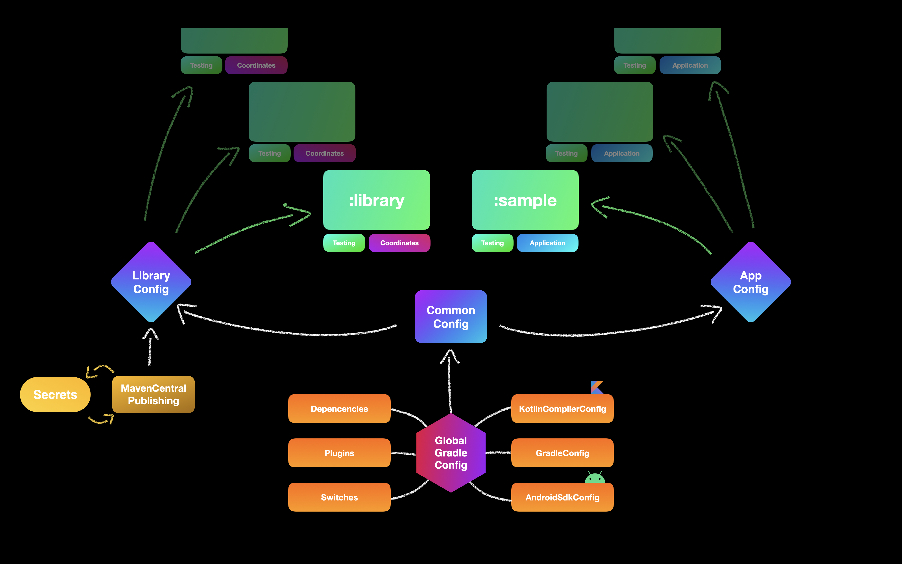

<p align="center">
  <a href="https://app.codacy.com/manual/android-library-template/ksprefs/dashboard"></a>
  <a href="https://kotlinlang.org/docs/releases.html"></a>
  <a href="https://gradle.org/releases/"></a>
  <a href="https://source.android.com/setup/start/build-numbers"></a>
  <a href="https://source.android.com/setup/start/build-numbers"></a>
  <a href="https://github.com/cioccarellia/android-library-template/blob/master/LICENSE.md"></a>
</p>

# android-library-template
This library is meant to be a complete, modular and easy to adopt template to create new libraries from scratch 
with things like multi modules, testing, dependency updates, directories kotlin compiler options customization, gradle scripts hierarchy, Android Studio run/debug configurations and mavenCentral artifacts deploying prepacked and tested 

The project contains 3 modules:
- `complex_numbers`: This is the library kotlin module. It implements [Quaternions](https://en.wikipedia.org/wiki/Quaternion)
- `sample`: This is a blank Android app depending on `:complex_numbers`, ideally for testing purposes.
- `buildSrc`: This module contains shared gradle configuration files.

The project depends on gradle 7.2. You need JDK Version 11 (>=) to build and use this project. It targets java version 8.

<br><br>


# Getting started
First thing, you want to be renaming `:complex_numbers` to your library name.

Replace every occurrence of `complex_numbers` inside that module with your new module name, then rename the module directory the same as your module new name.

Configure `KotlinCompilerConfig` and `AndroidSdkConfig`.

# Credentials
Fill in in `local.properties`
```
signing.keyId=                # Your GPG Key ID
signing.password=             # Your Key Passphrase
signing.secretKeyRingFile=    # Your GPG Key file path
ossrhUsername=                # Account Username
ossrhPassword=                # Account Password
sonatypeStagingProfileId=
stagingProfileId=
```

## sources
This template is available and would not be possible without the hard work of:
- @zsmb13 (https://getstream.io/blog/publishing-libraries-to-mavencentral-2021)
- @GetStream (https://github.com/GetStream/stream-chat-android)
- @afollestad (https://github.com/afollestad/library-template-android)

## recommanded reads
- [Organizing Gradle Projects](https://docs.gradle.org/current/userguide/organizing_gradle_projects.html)
